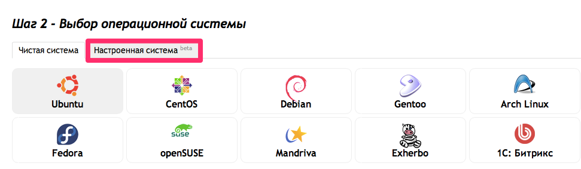
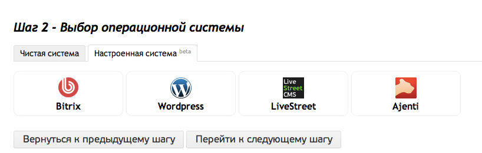

[Clodo.ru][1] предлагает своим клиентам возможность создания сервера с преднастроенным ПО, чтобы сэкономить время для настройки инфраструктуры.

* t
{:toc}

Что такое пресет
----------

Пресет представляет собой сервер, с установленной ОС Debian и дополнительным набором программ, которые можно выбрать при установке системы.

Доступные пресеты
----------

* [Wordpress][2] — система управления содержимым сайта с открытым исходным кодом. Написана на PHP. В качестве БД используется СУБД MySQL. Идеально подходит для ведения автономных блогов и новостных порталов.

* [Ajenti][4] - набор инструментов для управления сервером.

* [Livestreet][3] - CMS с открытым кодом, написанная на PHP. Применяется для создания блогов, социальных сетей, новостных порталов, а также может применяться в качестве PHP фреймворка. Благодаря архитектуре MVC, плагинам и шаблонам smarty может гибко расширяться под нужные цели.

* [Bitrix][5] - профессиональная система управления веб-проектами, универсальный программный продукт для создания, поддержки и успешного развития. Подходит для создания корпоротивных порталов, интернет-магазинов, информационных порталов, сайт сообществ, социальных сетей.

Установка пресета
----------
Установка перестов доступна в меню выбора операционных систем.
На шаге выбора ОС Вы можете выбрать настроенные системы, и среди них Вам будут доступны перечисленные CMS.

Процесс установки пресета
----------

После создания сервера, на него устанавливается ОС Debian. Как только процесс завершается, на сервере запускается набор скриптов для установки пресета, управляемые [Opscode Chef][6]. Chef - гибкий инструмент для развертывания и сопровождения ПО на серверах. Мы выбрали его не только потому что это наиболее подходящий способ управления автоматизированной установкой ПО на сервера, но и потому что это развивающаяся платформа, позволяющая нам открыто распространять рецепты. Сами же рецепты доступны в нашем [github-репозитарии][7]. Там вы можете не только ознакомиться с ними, но так же добавить свои рецепты и вносить правки в уже существующие.

Если пресет не установился
----------

Если пресет не установился спустя 20-30 минут после создания сервера/переусановки ОС, то необходимо подключиться к серверу через ssh, и выполнить команду:

    sh /var/adm/autoinstall/scripts/01-chef.sh

Если данный процесс завершается с ошибками, и пройдя по IP адресу сервера CMS недоступна, сообщите об этом техподдержке.

  [1]: http://clodo.ru "Clodo.ru"
  [2]: http://wordpress.org "Wordpress"
  [3]: http://livestreet.ru "Livestreet"
  [4]: http://ajenti.org "Ajenti"
  [5]: http://www.1c-bitrix.ru "Bitrix"
  [6]: http://www.opscode.com/chef/ "Chef"
  [7]: https://github.com/ClodoCorp/preset-cookbooks "preset-cookbooks"